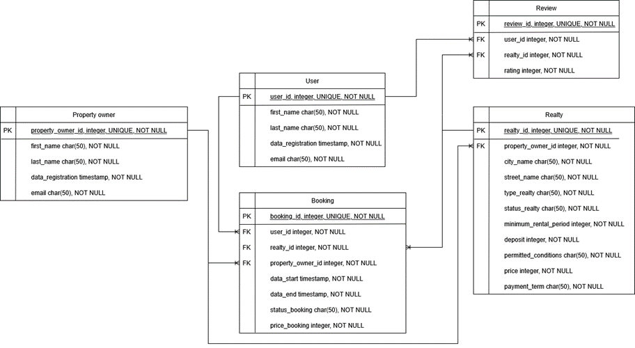
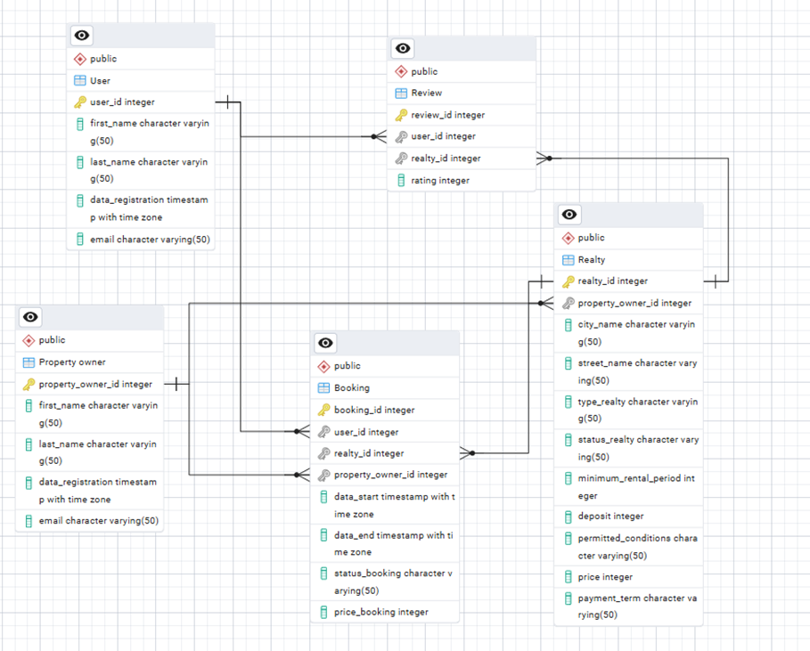

Розрахунково-графічна робота

тема: «Створення додатку бази даних, орієнтованого на взаємодію з СУБД PostgreSQL»

підготував: Ляшенко Даніїл
група: КВ-33

Структура бази даних з лабораторної роботи №1:

